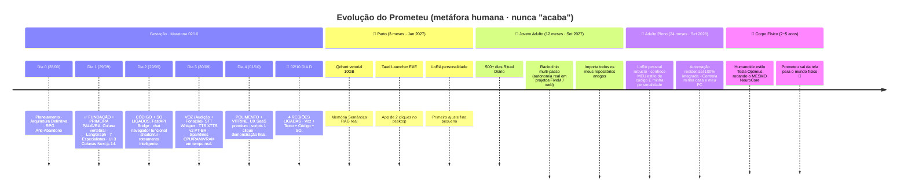

# 🧠 NeuroCore · Prometeu — Meu Cérebro de IA Pessoal 100% Local

> **Autor:** Jhon Ross 👨‍💻
> **Em desenvolvimento desde:** 28/09/2026 (Dia 0 - Gênese)
> **Licença:** MIT
> **Status atual:** 🟢 **Fase Embrião · Maratona 02/10 em andamento** (4 dias de sprint ultra-intensa para ativar 4 regiões cerebrais até 02/10/2026)

<p align="center">
  
  
  
  
  
  
</p>

---

## 🎯 O que é o NeuroCore / Prometeu?

> *"Prometeu roubou o fogo dos deuses para devolver aos humanos. Eu quero devolver o fogo da IA — que hoje está trancado em paywalls de API — para o meu desktop."* — Jhon Ross, autor.

**NeuroCore** é o núcleo (backend) de um **cérebro de IA multi-modal AGÊNTICO e 100% LOCAL** rodando no meu PC pessoal com Windows 11, AMD Ryzen 7 5700X3D e RX 7600 8GB.

**Prometeu** é o *ser humano digital* (a parte com personalidade, 7 regiões especializadas e aprendizado contínuo) que vive dentro do NeuroCore.

A visão de longo prazo:

- 🔒 **Zero dados saem do meu PC** por padrão (roteador híbrido só libera API externa se eu AUTORIZAR e dentro de um teto R$ bloqueável)
- 🪦 **Substituir TODAS as IAs pagas que uso hoje** (ChatGPT, Copilot, Gemini, Perplexity, HeyGen, etc.)
- 🌱 **Evolução infinita** por anos — o projeto nunca "acaba" (metáfora humana: embrião → criança → adolescente → adulto → robô físico humanoide estilo Tesla Optimus daqui a 2~5 anos)
- 🧱 **Vitrine profissional** do que sou capaz como Engenheiro de IA Fullstack Senior: arquitetura de longo prazo, orquestração de agentes, engenharia de hardware local, UX SaaS premium e mecanismos anti-abandono de projeto pessoal.

---

## 🧱 Stack Tecnológica (Escolhas Definitivas, NÃO PROVISÓRIAS)

> 🧠 **Filosofia arquitetural:** NADA é jogado fora. Todas as decisões aqui são pensadas para durar 2+ anos. O que for "provisório" (ex: SQLite antes do Qdrant) é encapsulado por uma **classe abstrata Python ABC** — a troca não impacta NENHUMA outra linha de código.

| Camada | Tecnologia | Por quê? |
|---|---|---|
| 🎼 Orquestração | **LangGraph Core 1.2** (não LangChain hardcoded) | StateGraph compilado de 3 nós + `TypedDict EstadoGrafo`. Anti-if-else-spaghetti. Melhor investimento de longo prazo pra agente multi-ferramenta. |
| 🔗 Comunicação Front ↔ Core | **FastAPI 0.141 + Uvicorn + WebSocket** | Padrão de mercado, SSE streaming de tokens / 1Hz sparklines. Mesmo código serve Tauri e navegador. |
| 🧠 Inferência LLM LOCAL | **Ollama v0.3+ (llama.cpp DirectML)** | ÚNICA camada viável para AMD RX 7600 em Windows 2026. NÃO buildar `llama-cpp-python` leva 4h+ de dor. Overhead 3~5% aceitável. |
| 🖥️ UI / Launcher Desktop | **Next.js 14.2.35 ESTÁVEL + TailwindCSS 3 + shadcn/ui + Tauri v2** | Next 14 / React 18 LTS em 2026 evita bug shadcn/ui com React 19. Tauri = app .exe 5~10MB (contra 200MB do Electron) com WebView nativo. |
| 💾 Persistência D1 (até semana q vem) | **SQLite 3 · WAL mode · synchronous NORMAL · RLock multi-thread** | ACID contra corrupção, zero dependências externas. Substituído Qdrant vetorial + mantido como KV / sessions / KV. |
| 🎨 Design System PERMANENTE | **PRETO #07070A · ÂMBAR #F59E0B** · 3 colunas FIXAS 240px / 1fr / 320px | Identidade visual forte, estilo SaaS Premium (Linear / Vercel / Obsidian). **Nunca mais discutimos cores.** |
| 🔀 Roteamento | Hybrid Router Modo TEIMOSO: Local SEMPRE primeiro | Teto mensal R$ bloqueável, chave OpenRouter vazia D1. Nenhum risco de custo inesperado. |
| 🧑‍🏫 Treinamento Contínuo | Ritual Diário 10min/dia · TRAE IDE como professor auxiliar · veto final Jhon 100% | Constitutional AI bootstrapping com eu mesmo como oráculo. |
| 🛡️ **Anti-Abandono (o segredo)** | **Sistema RPG 7 habilidades × N×100 XP + Feitos cronológicos (Wall of Wins)** · atomic write JSON | O risco Nº1 do projeto NÃO é hardware: É EU PARAR DE QUERER. Resolve isso com sistema de recompensa tangível TODO DIA. |

---

## 🏆 Wall of Wins — Feitos Oficiais (porque um projeto que não comemora as vitórias morre)

| # | Data | Marco | XP Concedido | Por que importa? |
|---|---|---|---|---|
| 🎖️ **0** | 28/09/2026 | **Nascimento — Fundação do NeuroCore** | +25 GLOBAL (7 habilidades) | 90% dos projetos de IA pessoais morrem no planejamento. Este marco prova que o planejamento foi CONCLUÍDO, a fundação é SÓLIDA. |
| 🎖️ **2** | 28/09/2026 | **Primeira Palavra do Prometeu 🎉** | +50 Córtex Geral / +5 outras | 10h depois do conceito Prometeu já respondia: *"Hey Jhon! 😊 Sou o Prometeu, seu cérebro de IA local e amigo de conversa!"* — 409 tokens · 526ms · llama3 na RX 7600. VALIDAÇÃO CONCRETA da arquitetura. |
| … | … | _continuamente atualizado — todo marco significativo entra aqui e no `docs/06 - Feitos…md`_ | … | … |

---

## 📅 Roadmap Cronologia Humana (Ciclo de Vida Infinito)



---

## 🚀 Como Rodar Localmente (no MEU hardware — replicável em máquinas AMD Windows parecidas)

> 📋 **Pré-requisitos mínimos (hardware do autor):**
> - CPU: AMD Ryzen 7 5700X3D ou Intel similar (8c/16t)
> - RAM: **32GB DDR4** (abaixo de 16GB não vai rodar modelos de 8B confortavelmente)
> - GPU AMD com **8GB GDDR6 mínimo** (backend DirectML obrigatório por enquanto). NVIDIA também funciona via CUDA se ajustar o Ollama.
> - SSD para código + HDD ~100GB para modelos e memória.

### 1. Clonar o repo

```bash
git clone https://github.com/Jhon-Ross/NeuroCore.git
cd NeuroCore
```

### 2. Instalar dependências (Ollama + Python + Node)

```powershell
# 1) Instale Ollama para Windows (uma vez)
winget install Ollama.Ollama
# 2) Configure OLLAMA_MODELS para o HDD/SSD de modelos (uma vez, permanente User)
[Environment]::SetEnvironmentVariable("OLLAMA_MODELS", "G:\models", "User")
Restart-Service Ollama  # reinicie o serviço

# 3) Baixe pelo menos 1 modelo
ollama pull llama3:latest      # 4.34GB · 100% funcional agora · fallback Dia 1
ollama pull llama3.1:8b        # ~6GB · padrão (se tiver espaço)

# 4) Crie ambiente virtual Python + instale tudo
python -m venv .venv
.\.venv\Scripts\Activate.ps1
pip install -r requirements.txt

# 5) Instale frontend
cd frontend
npm install
```

### 3. 2 cliques para ligar TUDO (após Maratona 02/10)

```powershell
# No PowerShell normal:
.\scripts\iniciar_prometeu.ps1
```

Isto vai ligar:
- ✅ FastAPI :8000 (backend cérebro)
- ✅ Next.js :3000 (UI chat)
- ✅ Abre `http://localhost:3000` no navegador padrão automaticamente

---

## 🧪 Resultados dos Primeiros Testes (Maratona D1 - Prova de Conceito)

Teste executado em hardware do autor · Ollama servindo `llama3:latest` na RX 7600 8GB:

| # | Pergunta de teste | Tokens | Latência (ms) | XP | Resposta coerente? |
|---|---|---|---|---|---|
| 1 | "Oi Prometeu! Se apresente em 2 frases…" (primeira palavra) | 409 | 526 | +7 | ✅ |
| 2 | "Como você está hoje? 1 frase curta" | 403 | 476 | +7 | ✅ |
| 3 | "2 habilidades que já estão funcionando D1" | 478 | 916 | +7 | ✅ |
| 4 | "Fórmula do seu nível no sistema RPG?" | 548 | 780 | +8 | ✅ |
| 5 | "Oii Prometeu, tudo beleza? Sou eu, Jhon." | 442 | 1259 | +7 | ✅ |

> 💡 **Velocidade prática**: ~3.2~7.7 tokens/segundo em conversação casual na RX 7600. **100% utilizável.** Nenhum dado saiu do PC. Nenhum custo.

---

## 🏗️ Estrutura de Pastas PERMANENTE

```
NeuroCore/ 🧠 (raiz código · SSD)
├── core/                               ← NÚCLEO NEUROCORE
│   ├── base_specialist.py                 · ABC contrato anti-divida (7 especialistas obrigados implementar 5 métodos)
│   ├── progress_rpg.py                    · 🎮 SISTEMA RPG ANTI-ABANDONO (prioridade 1!)
│   ├── logger.py                          · JSON Lines estruturado thread-safe
│   ├── memory_manager.py                  · 💾 SQLite ACID WAL mode (5 tabelas)
│   ├── feedback_store.py                  · Wrapper Ritual Diário training_samples
│   ├── orchestrator.py                    · 🎼 LangGraph StateGraph 3 nós (CORAÇÃO)
│   ├── hybrid_router.py                   · 🔀 Local SEMPRE primeiro
│   └── vram_manager.py                    · 📊 Snapshot Ollama /api/tags para sparklines
│
├── specialists/                        ← 7 REGIÕES CEREBRAIS DO PROMETEU
│   ├── __init__.py                         · REGIOES_CEREBRAIS dict dispatch (sem if-else!)
│   ├── llm_core/llm_core.py                · 🧠 Córtex Geral · ✅ ATIVO (Fase 1)
│   ├── llm_code/llm_code.py                · ⚡ Código · Fase 2 (Dia 2)
│   ├── stt_whisper/stt_whisper.py          · 👂 Audição · Fase 3
│   ├── tts_xtts/tts_xtts.py                · 🗣️ Fonação · Fase 3
│   ├── os_control/os_control.py            · 🖥️ S.O. · Fase 2 (Dia 2)
│   ├── image_flux/image_flux.py            · 👁️ Visual · Fase 5
│   └── home_control/home_control.py        · 🏠 Casa · Fase 4
│
├── frontend/                           ← UI Next.js 14 + Tauri v2 (3 colunas PERMANENTE)
│   └── src/app/{layout,page}.tsx
│   └── tailwind.config.ts                  · TOKENS PRETO #07070A + ÂMBAR #F59E0B PERMANENTES
│
├── scripts/                            ← Scripts 1 clique (PowerShell Windows)
│   ├── run_chat_cli.py                     · Loop CLI chat integrado com RPG + SQLite (Dia 1)
│   ├── iniciar_prometeu.ps1                · Launcher 2 cliques (D1 = CLI · D4 = API+Next)
│   └── parar_prometeu.ps1                  · Encerrador suave
│
├── docs/                               ← 📚 Árvore do Conhecimento (Obsidian)
│   ├── 00 - Genese (RAIZ) · 01 - Ritual · 02 - Marathon 02/10
│   ├── 03 - Diário YYYY-MM-DD · 04 - Design · 05 - Frontend/Tauri
│   ├── 06 - Feitos e Marcos (Wall of Wins) · 07 - Template Diário · 08 - FAQ e Visão de Futuro
│
├── local_memory/                       ← Fallback sandbox / HDD G:\ indisponível
│
├── requirements.txt                       · 14 deps Python principais (tudo verificado)
├── .gitignore                             · .venv / .next / local_memory / node_modules etc
└── README.md                              · ESTE ARQUIVO = Vitrine profissional 🎯

G:\ (HDD 100GB dedicado)
├── models\                              ← OLLAMA_MODELS=G:\models · Ollama gerencia tudo · blobs SHA
└── memory\                              ← 10GB p/ aprendizado
    ├── sqlite_db\prometeu_main.db          · Sessões, histórico, preferências, estado sistema
    ├── logs\YYYY-MM-DD.jsonl               · Rotação diária automática
    └── training_queue\                     · Itens Ritual Diário
```

---

## 🤝 Sobre mim · Jhon Ross

Engenheiro Fullstack apaixonado por construir tecnologia sólida, do design de arquitetura até o último pixel da interface. Meu foco é unir **engenharia de software** com **aplicações inteligentes** — desde sistemas críticos até projetos ambiciosos como o NeuroCore, onde exploro todo o potencial da tecnologia sem depender de terceiros.

Acredito em software bem feito: bem documentado, com decisões arquiteturais conscientes, UX tratada como prioridade e zero atalhos que gerem dívida técnica a longo prazo. O NeuroCore é a prova desse mindset em constante evolução.

- **🌐 GitHub:** [github.com/Jhon-Ross](https://github.com/Jhon-Ross)
- **📁 Este projeto:** [Jhon-Ross/NeuroCore](https://github.com/Jhon-Ross/NeuroCore)
- **📧 Contato:** LinkedIn (em breve)

---

<p align="center">
  <br/>
  <strong>🇧🇷 Feito no Brasil · 100% Local · Nenhum dado enviado.</strong>
  <br/>
  <small>
    <em>
      "O fogo não pertence aos deuses. Ele pertence a quem ousar construir o próprio fogo." — Prometeu (adaptado)
    </em>
  </small>
  <br/>
  <br/>
  
  
  
</p>
